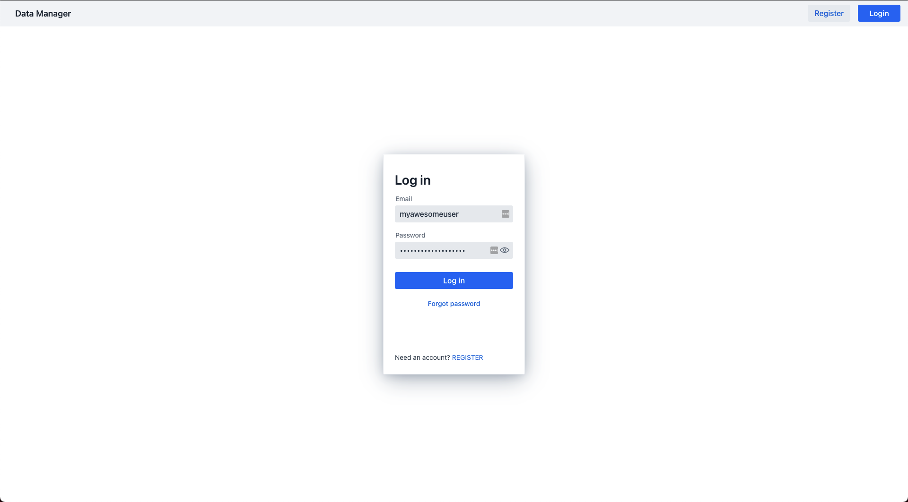
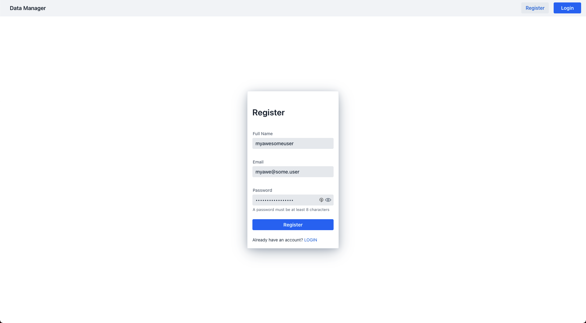

<div align="center">

# Data Manager

Data Manager - A web-based multi-omics data management platform for the biomedical life sciences
that enables FAIR-compliant data access.

[](https://github.com/qbicsoftware/data-manager-app/actions/workflows/build_package.yml)
[](https://github.com/qbicsoftware/data-manager-app/actions/workflows/run_tests.yml)
[](https://github.com/qbicsoftware/data-manager-app/actions/workflows/codeql-analysis.yml)
[](https://github.com/qbicsoftware/data-manager-app/releases)

[](https://github.com/qbicsoftware/data-manager-app/blob/main/LICENSE)

[](https://zenodo.org/doi/10.5281/zenodo.10371779)

</div>

## Overview:

- [How to Run](#how-to-run)
    * [Configuration](#configuration)
        * [Java Version](#java-version)
        * [Environment Variables](#environment-variables)
        * [Properties](#properties)
    * [Local Testing](#local-testing)
    * [Production Deployment](#production-deployment)
- [How to Use](#how-to-use)
    * [User Login](#user-login)
    * [User Registration](#user-registration)
- [Application Overview](#application-overview)
    * [Project Structure](#project-structure)
    * [Vaadin Framework](#vaadin-framework)
        * [Additional Information](#additional-information)
- [License](#license)

## How to Run

This application is based on maven and can be run after setting the
required [configurations](#configuration),
by typing `mvnw` (Windows), or `./mvnw` (Mac & Linux) in the command line and opening
http://localhost:8080 in your browser.

You can also import the project to your IDE of choice as you would with any
Maven project. Read more on [how to import Vaadin projects to different
IDEs](https://vaadin.com/docs/latest/flow/guide/step-by-step/importing) (Eclipse, IntelliJ IDEA,
NetBeans, and VS Code).

## Deploying to Production

To create a production build, call `mvnw clean package -Pproduction` (Windows),
or `./mvnw clean package -Pproduction` (Mac & Linux).
This will build a JAR file with all the dependencies and front-end resources,
ready to be deployed. The file can be found in the `target` folder after the build completes.

Once the JAR file is built, you can run it using
`java -jar target/datamanager-1.0-SNAPSHOT.jar`

### Configuration

#### Java Version

This application requires [Java 17](https://openjdk.java.net/projects/jdk/17/) to be build and run

#### Environment Variables

The env variables contain information about the salt and the secret. Both of them are used to
encrypt and decrypt user information.

| environment variable | description               |
|----------------------|---------------------------|
| `USER_DB_URL`        | The database host address |
| `USER_DB_USER_NAME`  | The database user name    |
| `USER_DB_USER_PW`    | The database password     |

The application properties file could look like the following:

```properties
spring.datasource.url=${USER_DB_URL:localhost}
spring.datasource.username=${USER_DB_USER_NAME:myusername}
spring.datasource.password=${USER_DB_USER_PW:astrongpassphrase!}
```

To change the port or the driver those can be added as environmental variables as well. Both are
preset with default values and
are therefore not mandatory to set

| environment variable | description          |
|----------------------|----------------------|
| `DM_PORT`            | The application port |
| `USER_DB_DRIVER`     | The database driver  |

```properties
server.port=${DM_PORT:8080}
spring.datasource.driver-class-name=${USER_DB_DRIVER:com.mysql.cj.jdbc.Driver}
```

As the application needs to send emails, you have to configure an smtp server as well.

| environment variable | description                                          |
|----------------------|------------------------------------------------------|
| `MAIL_HOST`          | The smtp server host (e.g. smtp.gmail.com)           |
| `MAIL_PASSWORD`      | The password to authenticate against the mail server |
| `MAIL_USERNAME`      | The username to authenticate against the mail server |
| `MAIL_PORT`          | The port to use for the SMTP connection              |

```properties
spring.mail.username=${MAIL_USERNAME}
spring.mail.password=${MAIL_PASSWORD}
spring.mail.host=${MAIL_HOST:smtp.gmail.com}
spring.mail.port=${MAIL_PORT:587}
```

For user email confirmation a specific endpoint and context-path (for example if the app runs in a different context than the root path) is addressed. This endpoint can be configured using
the following properties:

| environment variable           | description                                                       |
|--------------------------------|-------------------------------------------------------------------|
| `DM_SERVICE_HOST`              | The server address (if behind a proxy, the proxy domain name)     |
| `DM_HOST_PROTOCOL`             | The server protocol (http or https)                               |
| `DM_SERVICE_PORT`              | The server port (-1 for default)                                  |
| `DM_SERVICE_CONTEXT_PATH`      | The service context path of the application (empty for default)   |
| `EMAIL_CONFIRMATION_PARAMETER` | The name of the parameter to which to pass the confirmation token |
| `EMAIL_CONFIRMATION_ENDPOINT`  | The endpoint for the email configuration entry                    |
| `PASSWORD_RESET_ENDPOINT`      | The endpoint for the password reset entry                         |
| `PASSWORD_RESET_PARAMETER`     | The name for the password reset query parameter in the URL        |

Generated email confirmation links will look like `localhost:8080/login?confirm-email=<token>` with
the
default configuration.

```properties
# global service route configuration for mail interaction requests
service.host.name=${DM_SERVICE_HOST:localhost}
service.host.protocol=${DM_HOST_PROTOCOL:https}
service.host.port=${DM_SERVICE_PORT:-1}
# Set the context path, for example if your app runs behind a proxy
server.servlet.context-path=${DM_SERVICE_CONTEXT_PATH:}
# route for mail confirmation consumption
email-confirmation-endpoint=${EMAIL_CONFIRMATION_ENDPOINT:login}
email-confirmation-parameter=${EMAIL_CONFIRMATION_PARAMETER:confirm-email}
# route for password reset
password-reset-endpoint=${PASSWORD_RESET_ENDPOINT:new-password}
password-reset-parameter=${PASSWORD_RESET_PARAMETER:user-id}
```

Since the application will retrieve experimental design values from a list of defined vocabularies
a connection to the datasource containing this information is necessary:

| environment variable     | description                              |
|--------------------------|------------------------------------------|
| `OPENBIS_DATASOURCE_URL` | The vocabulary database host API address |
| `OPENBIS_USER_NAME`      | The vocabulary database user name        |
| `OPENBIS_USER_PASSWORD`  | The vocabulary database password         |

The application properties file could look like the following:

```properties
openbis.user.name=${OPENBIS_USER_NAME:openbis-username}
openbis.user.password=${OPENBIS_USER_PASSWORD:openbis-password}
openbis.datasource.url=${OPENBIS_DATASOURCE_URL:openbis-url}
```

#### Properties

The environment variables can either be set in the runtime configuration of your IDE or directly in
the [application properties file](https://github.com/qbicsoftware/data-manager-app/blob/main/webapp/src/main/resources/application.properties):

```properties
server.port=${DM_PORT:8080}
logging.level.org.atmosphere=warn
spring.mustache.check-template-location=false
# Launch the default browser when starting the application in development mode
vaadin.launch-browser=true
# To improve the performance during development.
# For more information https://vaadin.com/docs/flow/spring/tutorial-spring-configuration.html#special-configuration-parameters
vaadin.whitelisted-packages=com.vaadin,org.vaadin,dev.hilla,life.qbic
# Database setup configuration
spring.datasource.url=${USER_DB_URL:localhost}
spring.datasource.driver-class-name=${USER_DB_DRIVER:com.mysql.cj.jdbc.Driver}
spring.datasource.username=${USER_DB_USER_NAME:myusername}
spring.datasource.password=${USER_DB_USER_PW:astrongpassphrase!}
spring.jpa.hibernate.ddl-auto=update
# mail configuration
spring.mail.username=${MAIL_USERNAME}
spring.mail.password=${MAIL_PASSWORD}
spring.mail.host=${MAIL_HOST:smtp.gmail.com}
spring.mail.default-encoding=UTF-8
spring.mail.port=${MAIL_PORT:587}
# global service route configuration for mail interaction requests
service.host.name=${DM_SERVICE_HOST:localhost}
service.host.protocol=${DM_HOST_PROTOCOL:https}
service.host.port=${DM_SERVICE_PORT:-1}
# Set the context path, for example if your app runs behind a proxy
server.servlet.context-path=${DM_SERVICE_CONTEXT_PATH:}
# route for mail confirmation consumption
email-confirmation-endpoint=${EMAIL_CONFIRMATION_ENDPOINT:login}
email-confirmation-parameter=${EMAIL_CONFIRMATION_PARAMETER:confirm-email}
# route for password reset
password-reset-endpoint=${PASSWORD_RESET_ENDPOINT:new-password}
password-reset-parameter=${PASSWORD_RESET_PARAMETER:user-id}
# openbis-client credentials
openbis.user.name=${OPENBIS_USER_NAME:openbis-username}
openbis.user.password=${OPENBIS_USER_PASSWORD:openbis-password}
openbis.datasource.url=${OPENBIS_DATASOURCE_URL:openbis-url}

```

### Local testing

The default configuration of the app binds to the local port 8080 to the systems localhost. \
After starting the application it will be accessible at http://localhost:8080 in a browser of your
choice.

```
http://localhost:8080
```

### Production Deployment

To create a production build, call `mvnw clean package -Pproduction` (Windows),
or `./mvnw clean package -Pproduction` (Mac & Linux). \
This will build a JAR file with all the dependencies and front-end resources,
ready to be deployed.
The file can be found in the `target` folder after the build completes:

    |-target
    |---datamanager-{version}.jar
    |---...

Once the JAR file is built, you can run it using
`java -jar target/datamanager-{version}.jar`

## How To Use

This guide intends to showcase the features of the data-manager-application

### User Login

After startup the data manager application will redirect the user to the login screen hosted by
default at

```
http://localhost:8080/login
```

This view enables the user to login into an already existing account by providing the required
credentials.



Additionally, in this screen the user can request a password reset for his account if necessary. \
The user will then be contacted via the provided email address with the steps necessary to perform a
password reset.\
Finally, the user is able to switch to the [registration screen](#user-registration) by clicking on
the register button or the registration link

### User Registration

This view is accessible by clicking on the register button or the registration link in
the [Login Screen](#user-login).
It is hosted by default at:

```
http://localhost:8080/register
```

This view enables the user to register a new account by providing the required credentials:



After successful registration the user will be contacted via the provided email address with the
steps necessary to authenticate the generated account.

## Application overview

### Project structure

The project is composed of a [multi-module maven](https://maven.apache.org/) structure divided into
a `domain` and `webapp` module.
The `domain` module hosts the business logic for user and data management.

Examples include:

- `UserRegistrationService.java` in `src/main/java/life/qbic/apps/datamanager/services/` contains
  the application service used to register users for the user management domain context.
- `policies` package in `src/main/java/domain/usermanagement/` contains the business logic to
  validate provided user information.
- `repository` folder in `src/main/java/domain/usermanagement/` contains the connection logic
  between the application and the user database.

In contrast, the `webapp` module hosts the frontend components and services provided in the
application.

Examples include:

- `MainLayout.java` in `src/main/java/views/` contains the navigation setup (i.e., the
  side/top bar and the main menu). This setup uses
  [App Layout](https://vaadin.com/components/vaadin-app-layout).
- `views` package in `src/main/java` contains the server-side Java views of your application.
- `views` folder in `frontend/` contains the client-side JavaScript views of your application.
- `themes` folder in `frontend/` contains the custom CSS styles.

### Vaadin Framework

This application employs the frontend components released in version 23 of
the [vaadin framework](https://github.com/vaadin)

#### Additional Information

- Read the documentation at [vaadin.com/docs](https://vaadin.com/docs).
- Follow the tutorials at [vaadin.com/tutorials](https://vaadin.com/tutorials).
- Watch training videos and get certified
  at [vaadin.com/learn/training](https://vaadin.com/learn/training).
- Create new projects at [start.vaadin.com](https://start.vaadin.com/).
- Search UI components and their usage examples
  at [vaadin.com/components](https://vaadin.com/components).
- View use case applications that demonstrate Vaadin capabilities
  at [vaadin.com/examples-and-demos](https://vaadin.com/examples-and-demos).
- Discover Vaadin's set of CSS utility classes that enable building any UI without custom CSS in
  the [docs](https://vaadin.com/docs/latest/ds/foundation/utility-classes).
- Find a collection of solutions to common use cases
  in [Vaadin Cookbook](https://cookbook.vaadin.com/).
- Find Add-ons at [vaadin.com/directory](https://vaadin.com/directory).
- Ask questions on [Stack Overflow](https://stackoverflow.com/questions/tagged/vaadin) or join
  the vaadin [Discord channel](https://discord.gg/MYFq5RTbBn).
- Report issues, create pull requests in the vaadin [GitHub](https://github.com/vaadin/platform).

## License

This work is licensed under the [MIT license](https://mit-license.org/).

This work uses the [Vaadin Framework](https://github.com/vaadin), which is licensed
under [Apache 2.0](https://www.apache.org/licenses/LICENSE-2.0).

The University of Tübingen logo is a registered trademark and the copyright is owned by the [University of Tübingen](https://uni-tuebingen.de/).
