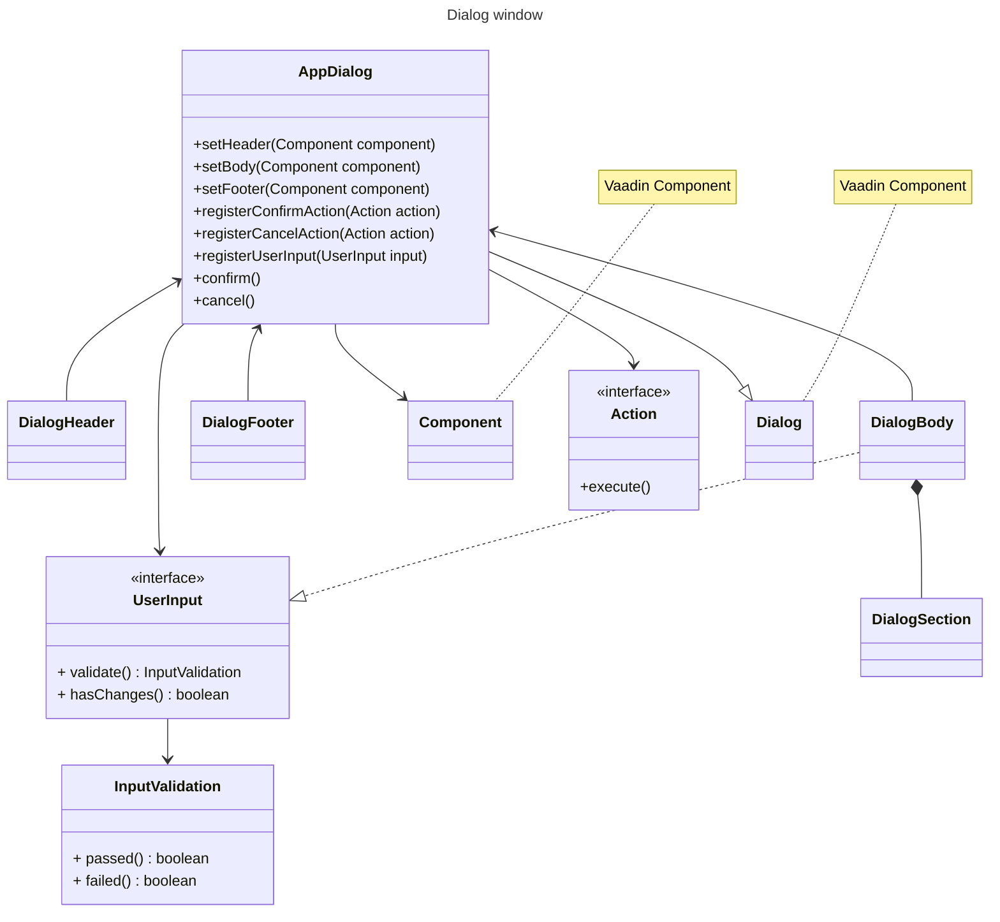
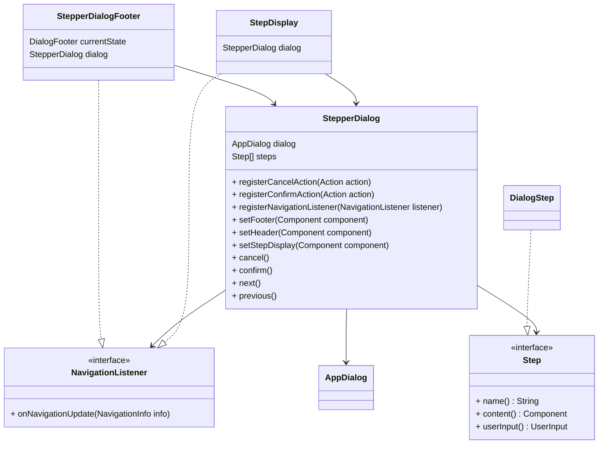
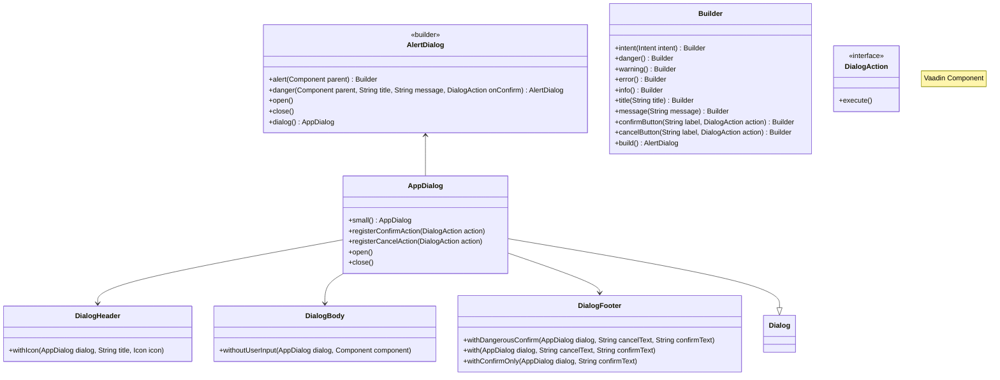

# Frontend components 
Some visual aid of our custom view components structure.

## App dialog



## Stepper dialog



## Alert dialog



### When to use

| Need | Pattern |
|---|---|
| Destructive action confirmation | `AlertDialog.danger(parent, title, message, onConfirm).open()` |
| Error requiring acknowledgment | `AlertDialog.alert(parent).error().title(...).message(...).confirmButton("OK", () -> {}).build().open()` |
| Error with redirect + cancel | `AlertDialog.alert(parent).error().confirmButton("Go...", nav).cancelButton("Cancel", close).build().open()` |
| Cancel / discard changes | `CancelConfirmationDialogFactory.cancelConfirmationDialog(action, key, locale).open()` |
| Success / info / transient feedback | `MessageSourceNotificationFactory.toast(...)` (unchanged) |
| Pending task with progress bar | `MessageSourceNotificationFactory.pendingTaskToast(...)` (unchanged) |

### Code examples

**Destructive confirmation (most common):**
```java
AlertDialog.danger(this,
    "Samples within batch will be deleted",
    "Deleting this Batch will also delete the samples contained within. Proceed?",
    () -> deleteBatch(batchId)).open();
```

**Error dialog with single button:**
```java
AlertDialog.alert(this)
    .error()
    .title("Cannot edit variables")
    .message("Editing experimental variables is only possible if samples are not registered.")
    .confirmButton("Okay", () -> {})
    .build()
    .open();
```

**Warning with cancel:**
```java
AlertDialog.alert(this)
    .warning()
    .title("Discard changes?")
    .message("By aborting, you will lose all entered information.")
    .confirmButton("Discard", () -> discard())
    .cancelButton("Continue Editing", () -> {})  // close dialog
    .build()
    .open();
```

### Deprecated: NotificationDialog

`NotificationDialog` has been removed and replaced with `AlertDialog`. The following classes were deleted:

- `AccessTokenDeletionConfirmationNotification`
- `BatchDeletionConfirmationNotification`
- `MeasurementDeletionConfirmationNotification`
- `QCItemDeletionConfirmationNotification`
- `PurchaseItemDeletionConfirmationNotification`
- `ProjectUserRemovalConfirmationNotification`
- `ExistingGroupsPreventVariableEdit`
- `ExistingSamplesPreventVariableEdit`
- `ExistingSamplesPreventSampleOriginEdit`
- `ExistingSamplesPreventGroupEdit`

If any code still references `NotificationDialog`, it will throw `UnsupportedOperationException` at runtime. Use the patterns above instead.


