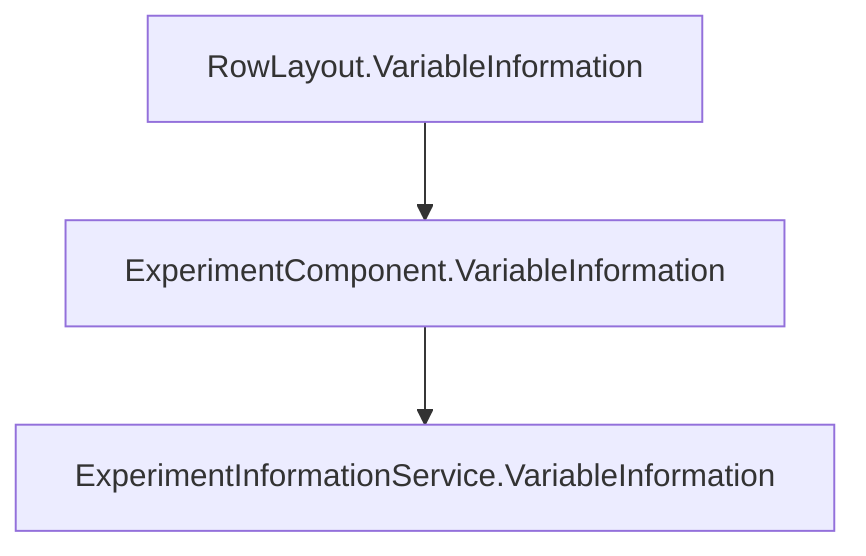
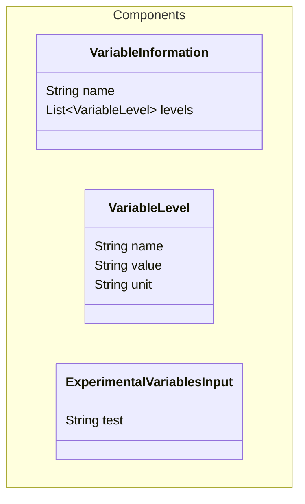

```mermaid
flowchart TB
    RowLayout.VariableInformation --> ExperimentComponent.VariableInformation --> ExperimentInformationService.VariableInformation
```

```mermaid
classDiagram
    namespace Components {
        class VariableInformation{
            String name
            List~VariableLevel~ levels
        }
        class VariableLevel {
            String name
            String value
            String unit
        }
        class ExperimentalVariablesInput{
            String test
        }
    }

```
