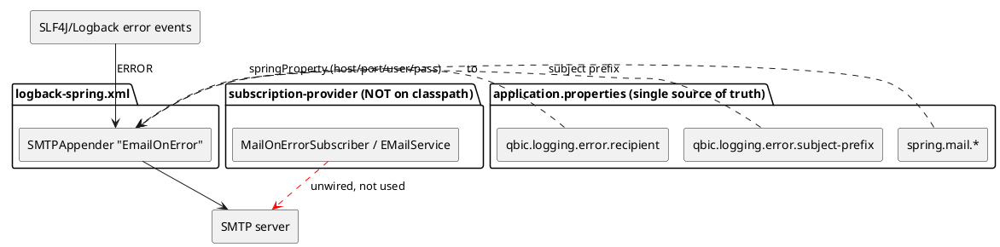

# 0005 — Developer email notifications for log errors

* Status: approved
* Deciders: [KochTobi](https://github.com/KochTobi)
* Date: 2026-09-04

Technical Story: Notify developers by email whenever an error appears in the application logs.

## Context and Problem Statement

Data Manager should notify developers by email whenever an error appears in the logs, so that
operational problems are surfaced without a human watching the console or the rolling log file.

The codebase already contains two parallel logging sinks and **two** SMTP stacks. The
`life.qbic.logging` facade (`LoggerFactory`) sends every `log.error(...)` down two branches:
one to SLF4J/Logback (console + rolling file, the real log output) and one to a
`SimplePublisher` that fans out to `Subscriber`s loaded via Java's `ServiceLoader`. That
subscriber fan-out is currently **dormant**: `subscrition-provider` — the module that hosts
`MailOnErrorSubscriber` and its `META-INF/services` registration — is **not** on the
`datamanager-app` classpath, so `ServiceLoader.load(Subscriber.class)` finds zero providers and
the fan-out is a dead end. Meanwhile the application's *active* email channel is Spring Boot's
`JavaMailSender` (via `email-service-provider`), which today only emails end users for domain
events (registration, project access, dataset connection) and never fires on log errors.

This ADR decides **how** to surface log errors to developers by email, and which of the two SMTP
stacks to reuse.

## Decision Drivers

* Errors must reach developers promptly and automatically, without manual log inspection.
* Avoid proliferating a third SMTP stack: prefer reusing a proven, already-configured sender.
* The recipient is a **developer mailing list**, not the end user a domain event targets.
* The solution must work in the deployed application, not rely on dormant/unwired modules.
* The change should be observable and testable without depending on an external mail server.

## Considered Options

* **Option B — Reuse Spring Boot's `JavaMailSender`** with a new `@Component` subscriber wired
  into the existing `logging` publisher fan-out.
* **Option A — Repair the dormant `subscription-provider` path** (ServiceLoader +
  `MailOnErrorSubscriber` + raw Jakarta Mail `EMailService`).
* **Option C — Logback SMTP appender** (a `SMTPAppender` on the error level).

## Decision Outcome

Chosen option: **Option C — Logback `SMTPAppender` with Spring-synced properties**, because it
delivers the requested "email on any error" behaviour declaratively, with no application code,
full coverage of all SLF4J/Logback errors, and failure isolation inside the logging subsystem.

Concretely, the design:

* A `ch.qos.logback.classic.net.SMTPAppender` named `EmailOnError` is added to
  `logback-spring.xml`, attached to the `life.qbic` logger.
* SMTP settings are **not duplicated**: `<springProperty>` resolves `spring.mail.host/port/username/password`
  from the Spring environment, so logback reads the exact same `spring.mail.*` configuration (and
  env overrides) as the rest of the application. `application.properties` remains the single
  source of truth.
* A **configurable subject prefix** (`qbic.logging.error.subject-prefix`) is read from
  `application.properties` and prepended to each mail's subject, so operators running multiple
  instances can set a distinct prefix per instance and tell which instance sent which email.
* The developer recipient list is configurable via `qbic.logging.error.recipient`.
* A `LevelFilter` restricts the appender to `ERROR` level.
* The dormant `subscription-provider` module and the `qbic.logging.mail.*` raw-Jakarta-Mail
  stack remain **unwired**.

### Positive Consequences

* **Config-only, no application code** — the notifier is declared entirely in
  `logback-spring.xml`; nothing to unit-test or wire in Spring.
* **Full error coverage** — it catches ERROR events from *all* SLF4J/Logback loggers, including
  third-party libraries (Spring, Vaadin, JobRunr), not only the QBiC `LoggerFactory` path.
* **Failure isolation** — a mail-sending problem stays inside the logging subsystem and cannot
  disrupt the application's own threads (in contrast to the `SimplePublisher` broadcasting thread).
* **Single SMTP source of truth** — `<springProperty>` keeps logback in sync with
  `spring.mail.*`, avoiding a third SMTP configuration surface.
* **Instance-identifiable emails** — the configurable subject prefix lets operators distinguish
  which instance sent a given error email.

### Negative Consequences

* Not programmatically testable — behaviour is verified by configuring a real SMTP server, not by
  mocking a sender in a unit test.
* Limited formatting/control — subject and body are logback layout patterns only; richer logic
  (rate-limiting, deduplication, attaching files, per-component routing) is not available without
  subclassing the appender.
* `SMTPAppender` sends synchronously on the logging thread when it triggers; a slow or unreachable
  SMTP server can stall the logging path (mitigated by errors being rare).

> **Follow-up (2026-09-04):** the dormant `subscription-provider` module — which hosted
> `MailOnErrorSubscriber` and the unused `qbic.logging.mail.*` raw-Jakarta-Mail stack — was
> **removed**. It was not on the `datamanager-app` classpath and the logback appender made it
> redundant. The `qbic.logging.mail.*` properties were deleted from `application.properties` and
> the distribution template accordingly. The `subscrition-api` interfaces remain (still used by
> the `logging` module's publisher fan-out).

## Pros and Cons of the Options

### Option A — Repair the dormant `subscription-provider` path

Restore the original design: add `subscription-provider` to `datamanager-app`, re-create the
`META-INF/services` registration, and give `MailOnErrorSubscriber` a public no-arg constructor so
`ServiceLoader` can instantiate it. Emails would go through the raw Jakarta Mail `EMailService`
(`Session` + `Transport.send`).

* Good, because it reuses the original intended mechanism (`Subscriber` fan-out) with minimal new
  code.
* Good, because it matches what the `logging` facade was originally designed for.
* Bad, because it introduces a **second SMTP stack** (raw Jakarta Mail) alongside Spring's
  `JavaMailSender`, duplicating SMTP configuration (`qbic.logging.mail.*` vs `spring.mail.*`).
* Bad, because `ServiceLoader` + no-arg constructor bypasses Spring dependency injection, making
  configuration and testing harder.
* Bad, because it re-activates a module that is currently unwired, increasing the attack/service
  surface and maintenance burden.

### Option B — Reuse Spring Boot's `JavaMailSender`

A new `@Component` implementing `Subscriber`, injected with the existing `JavaMailSender`/
`EmailServiceProvider`, and registered on the `SimplePublisher`.

* Good, because it reuses the active, production email channel and a single SMTP configuration.
* Good, because Spring DI makes the notifier testable (mock the `JavaMailSender`).
* Good, because it offers full programmatic control (formatting, rate-limiting, deduplication).
* Bad, because it only sees errors logged through the QBiC `LoggerFactory` facade — third-party
  library errors (Spring, Vaadin, JobRunr) are missed unless they also route through the facade.
* Bad, because it runs on the `SimplePublisher` broadcasting thread; a throwing subscriber can
  kill that fan-out thread (would require hardening the dispatch loop).
* Bad, because it requires new Java code, publisher wiring, and a test.

### Option C — Logback SMTP appender with Spring-synced properties (chosen)

Add a `ch.qos.logback` `SMTPAppender` at the error level. SMTP settings are resolved from
`spring.mail.*` via `<springProperty>`, so logback and Spring share one configuration source.

* Good, because it is entirely declarative (logback config only) and requires almost no code.
* Good, because it captures errors from *all* SLF4J loggers (including third-party libraries),
  not just the QBiC `LoggerFactory` path.
* Good, because failures stay isolated inside the logging subsystem and cannot disrupt
  application threads.
* Good, because `<springProperty>` keeps it in sync with `spring.mail.*`, avoiding a separate
  email configuration surface; a configurable subject prefix identifies the sending instance.
* Bad, because it is harder to control/test programmatically (subject/body are layout patterns
  only, and behaviour is verified against a real SMTP server rather than a mock).
* Bad, because it sends synchronously on the logging thread when triggered; a slow/unreachable
  SMTP server can stall the logging path.

## Links

* Related: [ADR-0002 — InvenioRDM API client design and external credential security](0002-invenio-rdm-api-client-credentials.md)
* Relates to the [`logging`](../../logging/pom.xml) and [`email-service-provider`](../../email-service-provider/pom.xml) modules.