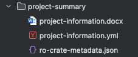

# RO-crates support in the data manager app

[RO-crates](https://www.researchobject.org/ro-crate/) (RO: Research Object) provide a way structured and machine-actionable way to bundle metadata and files in one single digital object. We will
look into how RO-Crates can be supported in the data manager.

## RO-Crate structure

The latest version up to the writing of this document is [RO-Crate 1.2-DRAFT](https://www.researchobject.org/ro-crate/specification/1.2-DRAFT/index.html). The last stable release is [RO-Crate 1.1](https://www.researchobject.org/ro-crate/specification/1.1/index.html).

## Use case: project information 

Project information such as title, identifier and contact person(s) are very basic and high-level metadata often
used throughout a research project life cycle. This information is frequently consumed by humans (e.g. project managers, principal investigators, funding agencies) as well as machines to process or re-use it (e.g. in computational workflows).

How can this metadata be provided in a FAIR compliant manner and serving both: humans and machines optimally.

### Suggested RO-Crate implementation

Possible structure for an RO-Crate containing QBiC project information:

This simple RO-Crate consists of only three files:

 - _ro-crate-metadata.json_: part of the RO-Crate specification, this file describes the content of the RO-crate object. You will see this file in every RO-Crate.
 - _project-information.yml_: some machine-actionable high level metadata about a QBiC project, e.g. title, identifier, contact
 - _project-information.docx_: some human-readable, visually appealing information about a QBiC project

