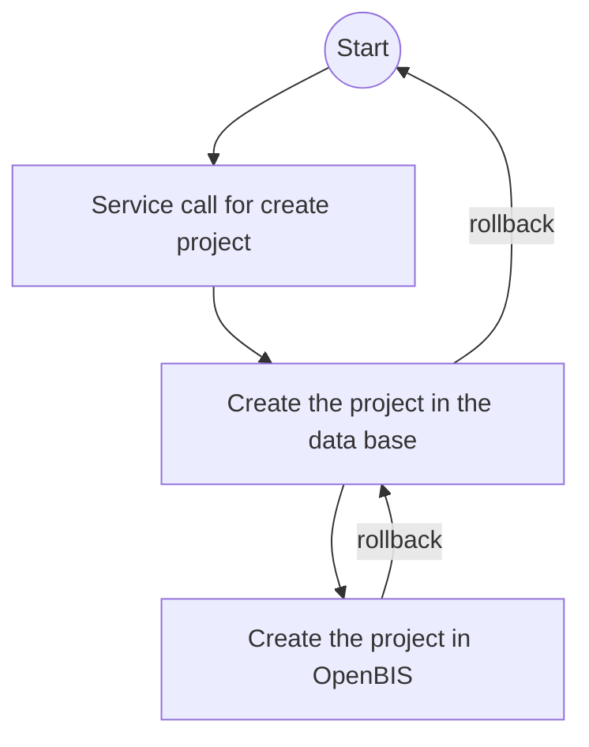

#bla

blubb

```mermaid
flowchart TB
    start((Start))
    cproject["Service call for create project"]
    cprojectDB["Create the project in the data base"]
    cprojectOpBis["Create the project in OpenBIS"]
    start --> cproject
    cproject --> cprojectDB
    cprojectDB --> cprojectOpBis
    cprojectOpBis -- rollback -->cprojectDB
    
    cprojectDB -- rollback --> start 
```
