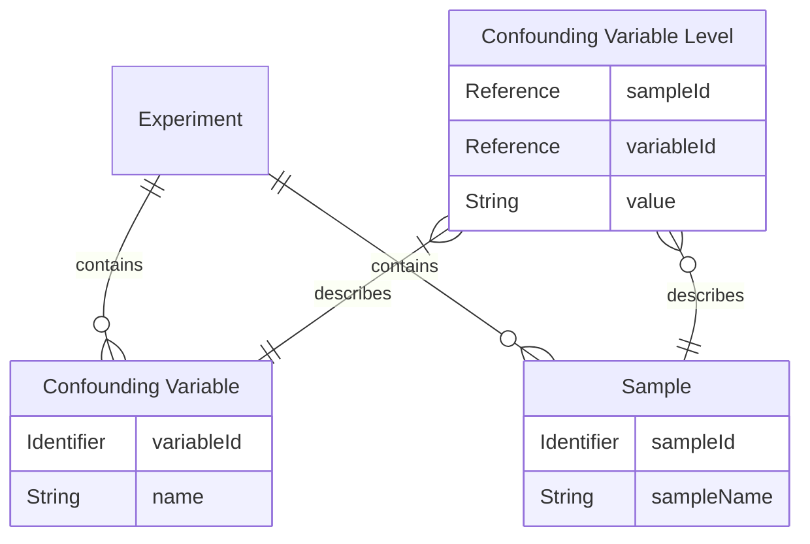
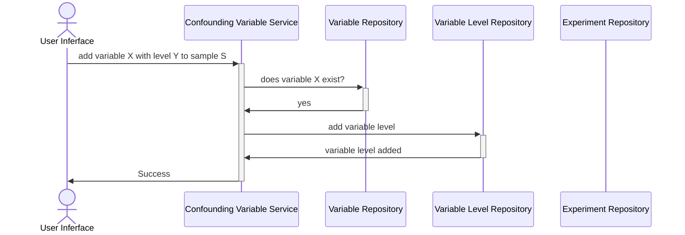
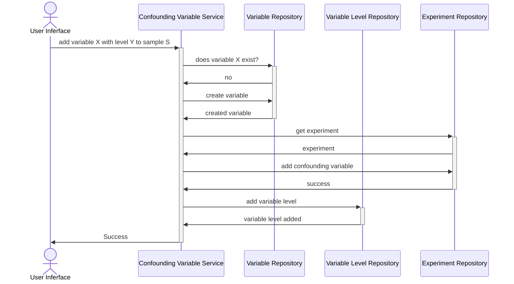

## ER Diagram

```mermaid
    erDiagram
    CVar["Confounding Variable"] {
        Identifier variableId
        String name
    }
    CVarLevel["Confounding Variable Level"] {
        Reference sampleId
        Reference variableId
        String value
    }
    SAMPLE["Sample"] {
        Identifier sampleId
        String sampleName
    }
    EXPERIMENT["Experiment"] {
    }
    EXPERIMENT one--zero or more SAMPLE : contains
EXPERIMENT one--zero or more CVar: contains
CVarLevel 1+--1 CVar: describes
CVarLevel zero or more--one SAMPLE: describes
```

## Sequence

### Variable exists

```mermaid
sequenceDiagram
    actor UI as User Inferface
    participant SERVICE as Confounding Variable Service
    participant VAR_REPO as Variable Repository
    participant LEVEL_REPO as Variable Level Repository
    participant EXP as Experiment Repository
    UI ->>+ SERVICE: add variable X with level Y to sample S
    SERVICE ->>+ VAR_REPO: does variable X exist?
    VAR_REPO ->>- SERVICE: yes
    SERVICE ->>+ LEVEL_REPO: add variable level
    LEVEL_REPO ->>- SERVICE: variable level added
    SERVICE ->>- UI: Success
```

### Variable does not yet exist

```mermaid
sequenceDiagram
    actor UI as User Inferface
    participant SERVICE as Confounding Variable Service
    participant VAR_REPO as Variable Repository
    participant LEVEL_REPO as Variable Level Repository
    participant EXP as Experiment Repository
    UI ->>+ SERVICE: add variable X with level Y to sample S
    SERVICE ->>+ VAR_REPO: does variable X exist?
    VAR_REPO ->> SERVICE: no
    SERVICE ->> VAR_REPO: create variable
    VAR_REPO ->>- SERVICE: created variable
    SERVICE ->>+ EXP: get experiment
    EXP ->> SERVICE: experiment
    SERVICE ->> EXP: add confounding variable
    EXP ->>- SERVICE: success
    SERVICE ->>+ LEVEL_REPO: add variable level
    LEVEL_REPO ->>- SERVICE: variable level added
    SERVICE ->>- UI: Success
```
