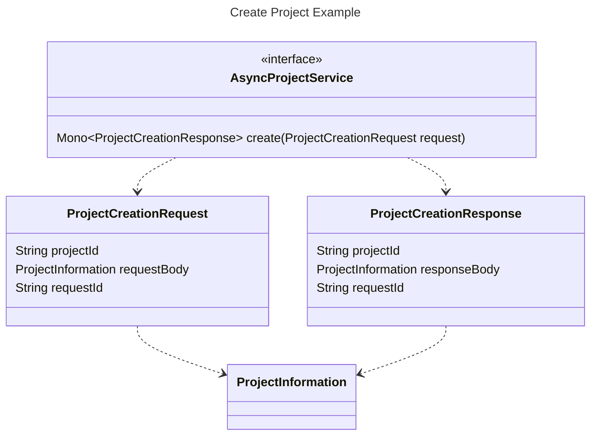
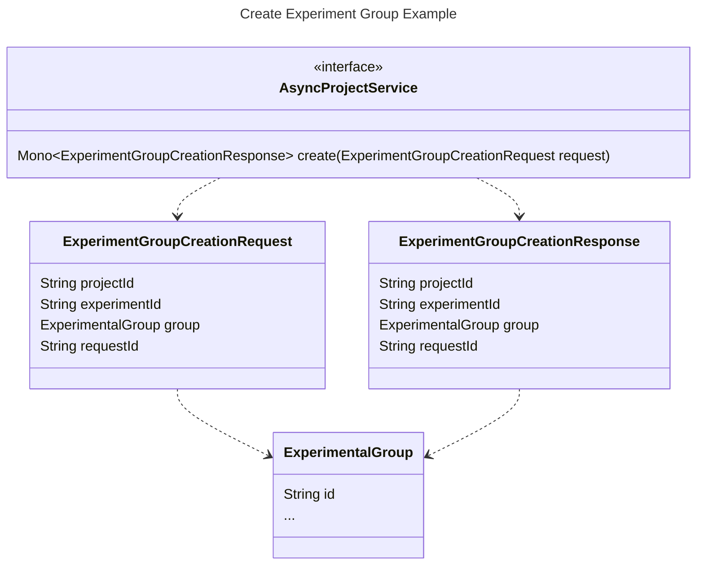
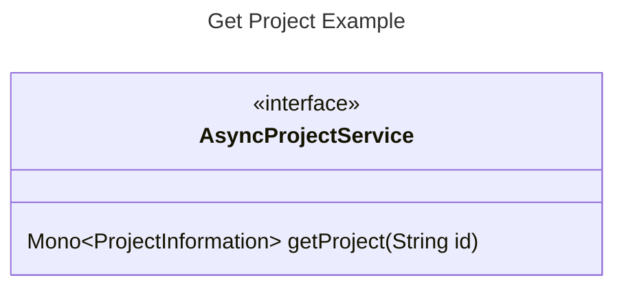
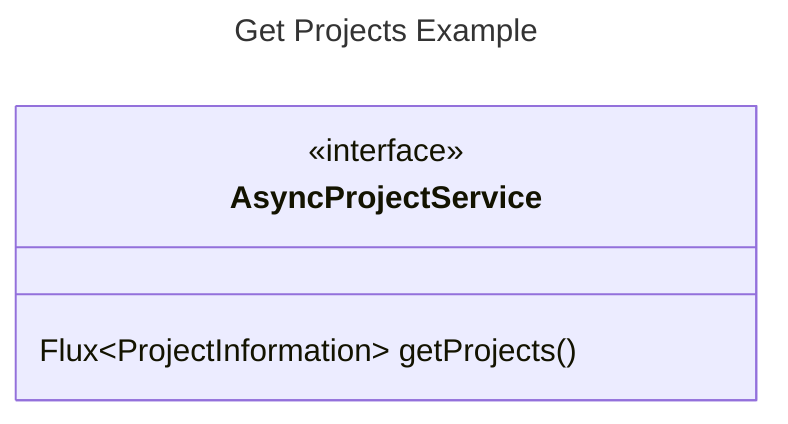
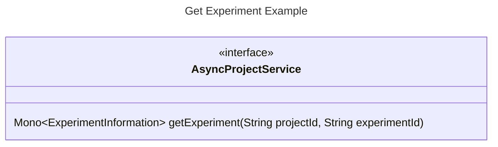
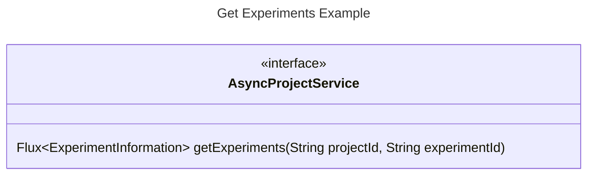
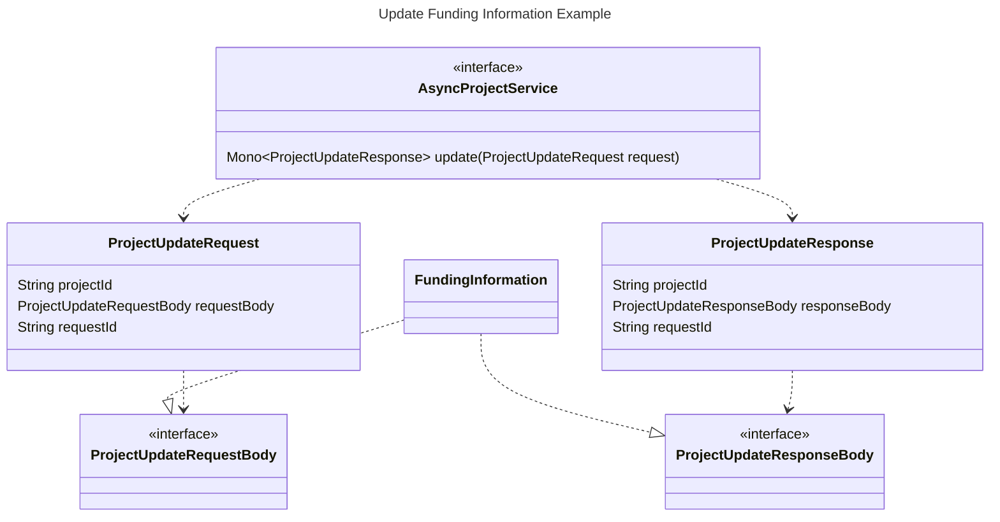
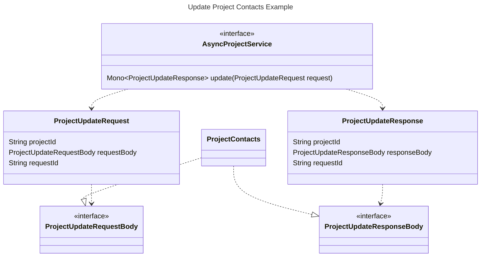

# Service API

The idea of the service API is to create a uniform interface to interact with Data Manager
ressources from a user agent, for example the browser. Since the project uses Vaadin, the API is
written in Java and provides an easy integration
in Vaadin Flow.

The API provides access and manipulation of resources similar to what you know from REST, with
slightly different names though:

- Create (similar to POST)
- Get (similar to GET)
- Update (similar to PATCH, partial updates are possible)
- Delete (similar to DELETE)

This documentation describes the conceptual idea of how the service API is composed and works.
Details and semantics
are suspected to change.

## Create examples

Creating a new resource shall be intuitive and straight forward. No new concepts than the resource
model
itself should be required.
For example, to create a new project, just create a `Project Information` object without an ID (
there is none, needs to be given by the system).
Once the resource has been created, the requests will result in the same object model with an ID.

To provide clients with an easy-to-use resource creation interface, the API shall return
the created resource under the same model again, provided with the generated ID.

### Create a project

### Creating a sub-resource
Creating a sub-resource that are in a many-to-one relationship with their parent resource should be made easy.

For example, creating an `Experimental Group` for an existing `Experiment` shall be a no-brainer. Therefore, it is 
adviced that the API provides semantically matching request objects for these tasks, that contain
the required identifiers to enable the service to create these resource enrichments.

For example, the method call for creating a new `Experimental Group` could be `create(ExperimentGroupCreationRequest request)` and the request
contains the required IDs to enable the service to perform the task.

## Get examples

### Get a specific project

### Get all projects

### Get experiment

### Get all experiments for a project

## Update examples

Updates of resources can be done partially, for example by providing the information for the
smallest information container the API provides for a certain ressource. For example
`Project Information` contains
`Funding Information`. The API shall provide partial updates of a project for `Funding Information`
without
providing all other information properties of a project.

The size and semantics for the smallest information unit of a resource are subject to
use case discussions and shall be aligned with what needs to be done by users or user agents.

The API shall return the updated partial information again in the response, so the client
can directly use it to make partial updates on the client side. There is no need to reload the
full resource and perform an additional service request.

### Update a specific project

### Update project contacts

### Update of a sub-resource with multiplicity

Sometimes a resource contains more than one sub-resource of the same type. This happens, when there
is a one-to-many relationship between the resource and its sub-resource. For example an experiment can
contain one or more experimental groups.

To enable clients to update a certain sub-resource, a combination of the parent resource's ID and the local 
ID of the sub-resource is required.

For example to update an `Experimental Group` of an `Experiment`, the API shall provide a method like `update(ExperimentalGroupUpdateRequest request)`. The object request needs to provide
the required IDs to ensure that the service can perform the task. Each request is transactional for the resource.

## Delete Example

Deletion of a resource or sub-resource shall be possible with the resource ID or the combination of the resource ID
and its sub-resource local ID.

For example an `Experimental Group 1` in an `Experiment X` for `Project A` should be deletable by the client by e.g. calling `delete(ExperimentalGroupDeletionRequest request)`. The combination of project ID, experiment ID and experimental group ID ensures the
identity of the resource manipulation. Each request is transactional for the resource.

