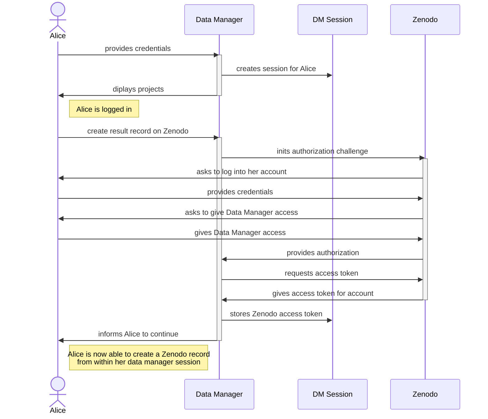

# Integration of external services

Data Manager integrates services like ORCID (as identity provider) or Zenodo (as resource provider).

This document describes the technical view on how it has been integrated in the application and its
important components
for developers.

## OAuth 2.0

Data Manager uses the OAuth 2.0 protocol to acquire access resources on behalf of the resource
owner (e.g. the user in Data Manager).

The Data Manager application acts as the client and for allowing it to perform actions against an
extern resource such as Zenodo, it needs to get the resource owner's (user's) allowance first.

### Zenodo

We assume, that the user has already logged-in their Data Manager account and want to interact with
Zenodo, in order to create a draft on Zenodo with some metadata available
in their Data Manager project.

The current user Alice represents the resource owner and has an account on Zenodo and Data Manager.

First, let us see on a very top level view what happens:



In order to make it work, we needed to tweak the default OAuth2.0 implementation flow of Spring in
order to make it
work for the Data Manager use case.

We have some extra components

- **Custom OAuth 2.0 callback controller**: intercepts the authorization challenge with Zenodo after
  the authorization has been granted by the resource owner
- **Custom OAuth 2.0 access token response client**: turns out Zenodo does not like `client_id` and
  `client_secret` being transferred in the HTTP header. So we need to put it in the HTTP message
  body as form data.
- **Additional custom security context**: We don't want to interfere with the Spring security
  context and the security implementation context of the logged-in principal. So we use an
  additional one for the remote resource access only.

#### Custom OAuth2.0 callback controller

To the time of writing in the ``ZenodoOAuth2Controller.java`` class. As a Spring servlet controller,
the route `/zenodo/callback` will be registered by Spring and we can interecept all incoming http
requests. Exactly what we want when Zenodo grants Data Manager access on behalf of the user.

_What is wrong with the default Spring OAuth 2.0 handling?_

Nothing. 

However:

1. Zenodo does not accept the access token challenge as it would be done Springs default
implementation. ``client_id`` and ``client_secret`` are usually passed Base64-encoded as Basic
authentication in the http message header. If you do that against the Zenodo API, you will receive a status code ``404`` (not found). 

2. We need to enrich the user session with the acquired remote service access token. The default OAuth 2.0 flow wil otherwise replace the current user's existing security context.

This magic happens in our custom controller implementation and only in the case of handling third party access tokens. This does not interfere with the OAuth 2.0 flow that we use for log in via ORCID.

#### Additional custom security context

Next to the primary Spring security context, we enrich the session with additional principals, that are secondary and only for accessing remote resource server (e.g. Zenodo). 

Although the access tokens have a longer life span (in case of Zenodo at the time of writing **2 months**), we decided against storing them
persistently on our side. It adds complexity to the Data Manager's implementation since access tokens are very sensitive material. 

So access tokens currently only live as long as the user's current Data Manager session.
After that, users need to authorize Data Manager again, which is fast and easy, especially if they use ORCID as identity provide in both cases.

After successful access token retrieval, it is added to the Data Manager Security Context:

```java
import life.qbic.datamanager.security.context.DMOAuth2BearerToken;
import life.qbic.datamanager.security.context.DMSecurityContext;

DMOAuth2BearerToken token = new DMOAuth2BearerToken(accessToken, refreshToken, "zenodo");
var contextBuilder = new DMSecurityContext.Builder();
DMSecurityContext context = contextBuilder.addPrincipal(token).build();

// append context to the user session 
session.addAttribute("DATA_MANAGER_SECURITY_CONTEXT", context);
```

So in any authenticated context in the Data Manager, we can now look for existing access tokens if the
user already granted access and do actions on behalf of them from the app.


