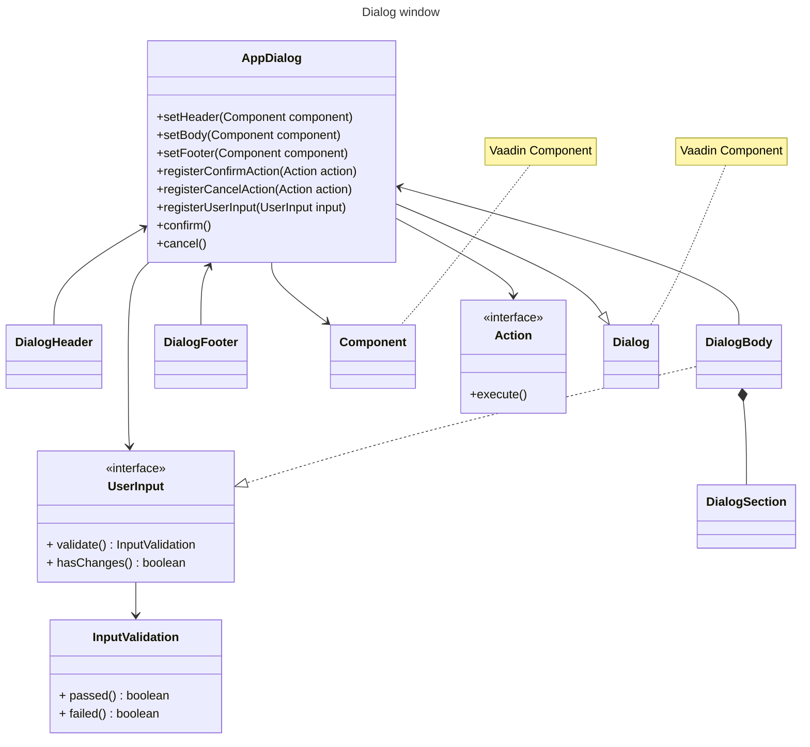
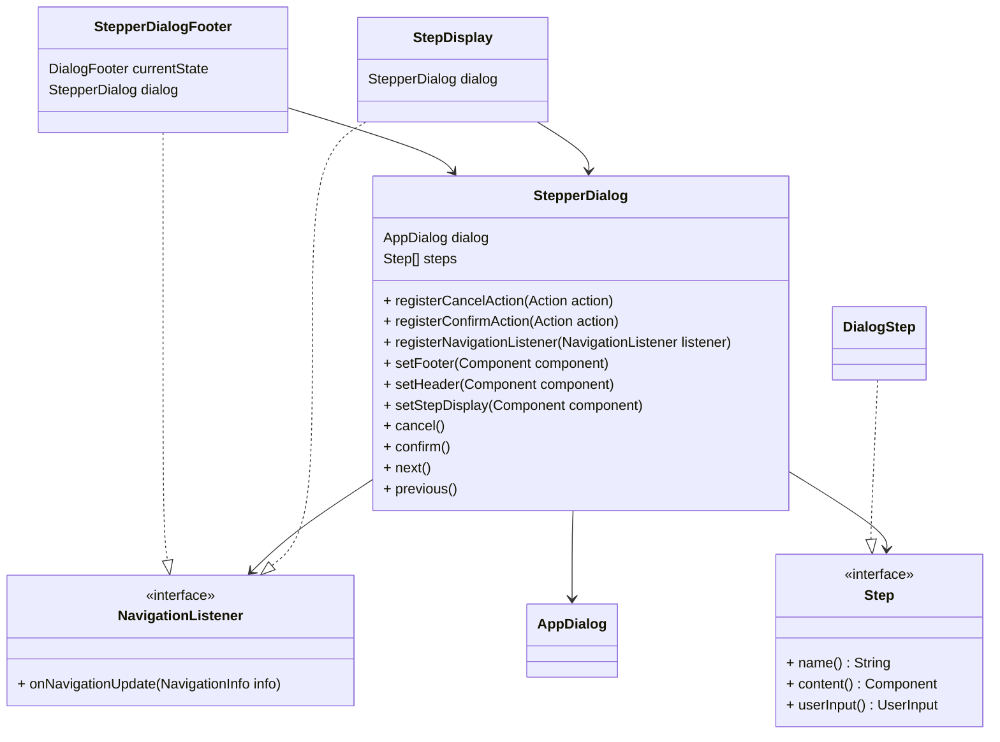

# Frontend components 
Some visual aid of our custom view components structure.

## App dialog

```mermaid
---
title: Dialog window
---

classDiagram
    note for Component "Vaadin Component"
    note for Dialog "Vaadin Component"
    AppDialog <-- DialogHeader
    AppDialog <-- DialogBody
    AppDialog <-- DialogFooter
    DialogBody ..|> UserInput
    UserInput --> InputValidation
    AppDialog --> Component
    AppDialog --> Action
    AppDialog --|> Dialog
    AppDialog --> UserInput
    DialogBody *-- DialogSection
    
    class Dialog {
        
    }
    
    class DialogSection {
        
    }

    class Component {
    }

    class AppDialog {
        +setHeader(Component component)
        +setBody(Component component)
        +setFooter(Component component)
        +registerConfirmAction(Action action)
        +registerCancelAction(Action action)
        +registerUserInput(UserInput input)
        
        +confirm()
        +cancel()
    }

    class DialogHeader {
    }

    class DialogBody {
    }

    class Action {
        <<interface>>
        +execute()
    }

    class DialogFooter {
    }

    class InputValidation {
        + passed() boolean
        + failed() boolean
    }

    class UserInput {
        <<interface>>
        + validate() InputValidation
        + hasChanges() boolean
    }

```

## Stepper dialog

```mermaid

classDiagram
    
    StepperDialogFooter ..|> NavigationListener
    StepperDialogFooter --> StepperDialog
    StepperDialog --> NavigationListener
    DialogStep ..|> Step
    StepperDialog --> AppDialog
    StepperDialog --> Step
    StepDisplay ..|> NavigationListener
    StepDisplay --> StepperDialog
    
    
    class Step {
        <<interface>>
        + name() String
        + content() Component
        + userInput() UserInput
    }
    
    class AppDialog {
        
    }
    
    class DialogStep {
        
    }
    
    class StepperDialog {
        AppDialog dialog
        Step[] steps
        + registerCancelAction(Action action)
        + registerConfirmAction(Action action)
        + registerNavigationListener(NavigationListener listener)
        + setFooter(Component component)
        + setHeader(Component component)
        + setStepDisplay(Component component)
        + cancel()
        + confirm()
        + next()
        + previous()
        
    }
    
    class NavigationListener {
        <<interface>>
        + onNavigationUpdate(NavigationInfo info)
    }
    
    class StepDisplay {
        StepperDialog dialog
    }
    
    class StepperDialogFooter {
        DialogFooter currentState
        StepperDialog dialog
        
    }

```

