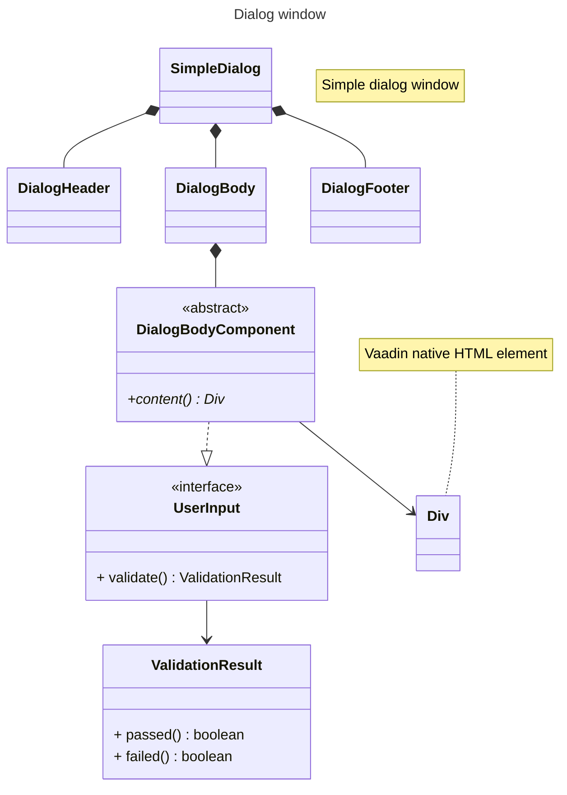

# Frontend components 
Some visual aid of our custom view components structure.

## Dialog window

```mermaid
---
title: Dialog window
---

classDiagram
    note "Simple dialog window"
    note for Div "Vaadin native HTML element"
    SimpleDialog *-- DialogHeader
    SimpleDialog *--DialogBody
    SimpleDialog *-- DialogFooter
    DialogBody *-- DialogBodyComponent
    UserInput --> ValidationResult
    DialogBodyComponent ..|> UserInput
    DialogBodyComponent --> Div
    
    class Div {
       
    }
    
    class SimpleDialog {
        
    }
    
    class DialogHeader {
        
    }
     
    class DialogBody {
        
    }
    
    class DialogFooter {
        
    }
    
    class DialogBodyComponent {
        <<abstract>>
        +content() Div*
    }
    
    class ValidationResult {
        + passed() boolean
        + failed() boolean
    }
    
    class UserInput {
        <<interface>>
        + validate() ValidationResult
    }

```
